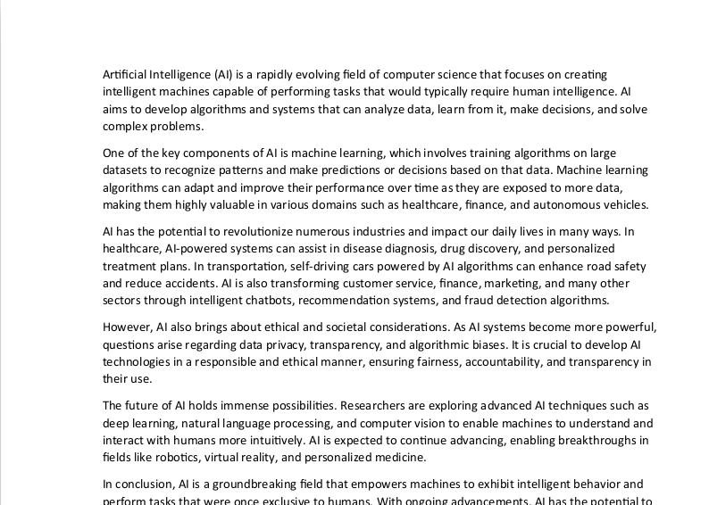
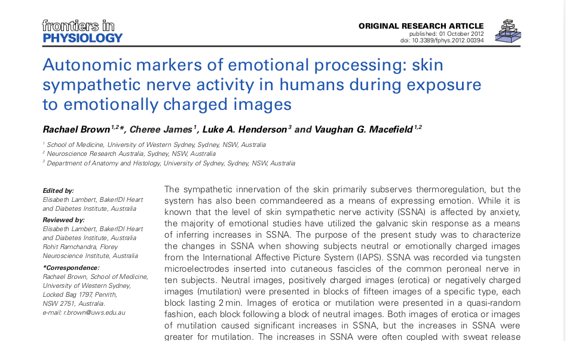

# PDF to MP3 converter

This project can help you when you need to convert text to audio.
You just need to give it a pdf file as input, and it'll give you mp3 audio
as output.

## how to use:
Clone the repo to your local machine:

```bash
https://github.com/Tar8117/foodgram-project-react.git
```

OR within SSH use this link to clone:
```bash
git@github.com:Tar8117/foodgram-project-react.git
```

Create and activate the venv:

Linux:
```bash 
python -m venv venv
```
```bash 
source venv/bin/activate
```
Windows:
```bash 
python -m venv venv
```
```bash 
source venv\Scripts\activate
```

Install the dependencies from `requirements.txt`:
```bash 
pip install -r requirements.txt
```
That's all! Now you can test this code just running `main.py`.
In `pdf_files` directory I put two samples as demo, so you can try it 
(press `enter` if you want to try out sample pdf files when program
asks you for path and language)

OR 

You can put your pdf into `pdf_files` directory and copy the path clicking right
mouse button, or even you can copy absolute path from anywhere on your local machine
and past it as input.

## Supported languages:
`en, ru`

## ATTENTION
To get a proper audio make sure that your pdf text style is similar to sample
pdf text style.


Do not use pdf fomatted as on screenshot below. It may cause wrong audio output


Have fun!

---
